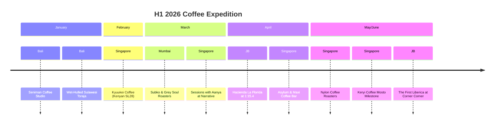
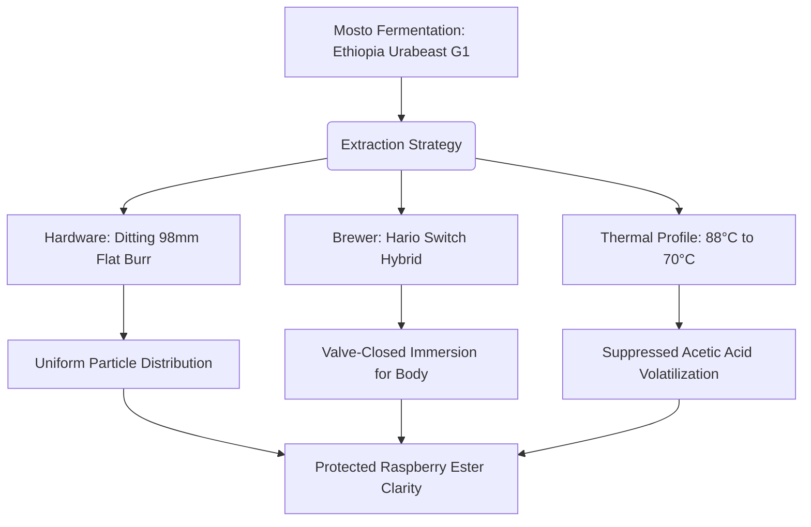

# The Extraction Chronicles
## H1 2026: A Semester in Specialty

*Thirty-eight cups. Fourteen origins. A six-month journey across four cities.* 

Welcome to the first dispatch of *The Extraction Chronicles*. If you’re reading this, you probably know your Geshas from your Bourbons, and you understand why the difference between a 1:15 and a 1:17 ratio is anything but trivial.

This past half-year has been a deeply personal exploration of extraction, terroir, and the ever-evolving boundaries of coffee processing. From starting the year with the earthy densities of wet-hulled Indonesian beans at Seniman in Bali, to dissecting the fragile linalool terpenes of a Mosto fermentation in Singapore, these 38 cups represent a rigorous calibration of the palate. 

Here is the story of H1 2026, told through the cups that defined it.

---

### The Expedition Timeline

### 1. The Mumbai Detour & The Cross-Border Runs

The journey wasn't confined to my usual Singapore haunts. A March detour to Mumbai offered a fascinating glimpse into India's rapidly maturing specialty scene. At Subko Coffee Roasters, a very light roast (Agtron 89) of the Project Pearl Ratnagiri provided a surprisingly restrained anaerobic expression. Grey Soul’s Zoya Estate "Raspberry in Loop" swung the pendulum the other way with a heavy, multi-stage anaerobic process that leaned hard into chocolate and heavy body. 

But it was the short hops across the border to Johor Bahru that yielded some of the most technical surprises. A pour-over of an Anaerobic Washed Typica Mejorado from Hacienda La Florida on an EK Omnia and Origami conical brewer delivered a masterclass in thermal phase shifting: distinct lime acidity when hot, gracefully resolving into red plum as it cooled. 

Then, there was Corner Corner in JB. A low-dose (13g), 1:14.6 ratio extraction on a Timemore Gold burr delivered something entirely unexpected: my first recorded *Coffea liberica*. The proprietary Jekyll & Hyde controlled fermentation transformed what could have been smoky-woody funk into an approachable, longan-forward fruit punch. A brilliant novelty that proved Liberica's expanding potential.

### 2. Passing the Palate: Sessions with Aanya

Coffee is often a solitary pursuit of perfection, but sharing it changes the geometry of the experience. The sessions with my daughter, Aanya, were undoubtedly the emotional highlight of this half. 

Introducing her to specialty filter at Narrative Coffee Stand with a Natural Pacamara from El Salvador was a deliberate choice. The Pacamara’s beginner-friendly fruit esters—stewed apples and apricot—provided a welcoming entry point. Later, at Asylum, a Castillo Watermelon Co-Ferment pushed the boundaries further. The experimental watermelon processing enhanced the volatile ester complexity, but the dual-temperature extraction kept the layered aromatic architecture controlled and sweet. Seeing her palate recognize these distinct, layered notes is a milestone I’ll carry with me long after the cups are empty.

### 3. The Keryi Connection & The Mosto Milestone

If I had to highlight a technical crucible for H1 2026, it would be my visits to Keryi Coffee in Singapore. Their baristas consistently demonstrated an advanced understanding of extraction mechanics, particularly when leveraging 98mm flat burrs.

The standout was the **Ethiopia Urabeast G1** from Guji, featuring a *Mosto Fermentation*—a process where cherry pulp juice acts as the fermentation medium. 

This deliberate suppression of acetic acid at a lower entry temperature (88°C) allowed the bright raspberry and floral esters to express cleanly before any winey compounds could dominate. The tight 1:14 ratio built body without over-extracting. It was a process-honest expression that set a new benchmark for controlled fermentation in my archive.

### 4. The Technical Standouts & Hall of Fame

Out of 38 cups, a few distinct extractions separated themselves from the pack. While the El Obraje washed remains a foundational favorite for clarity, these three entries defined the boundaries of what was possible in H1 2026.

| Coffee / Origin | Process & Varietal | Hardware & Execution | Why it matters |
| :--- | :--- | :--- | :--- |
| **Peru Cajamarca Gesha** *(Wilder Garcia)* | Washed Gesha | Option-O Lagom P64, Flash-Chilled Iced Pour-over | Cold dilution perfectly stabilized the highly volatile floral monoterpenes (linalool), resulting in an incredibly elegant, jasmine-heavy expression. |
| **Yellow Sudan Rume** *(Jardines Del Eden)* | EF2 Extended Fermentation Natural | Lagom P64, April Brewer, 1:16 Ratio | Controlled ester development. The flat-bottom two-pour maintained bed saturation, preserving delicate geraniol top notes (lemongrass) while avoiding acetic overproduction. |
| **Colombia Juan Martin** *(Banexport)* | Washed Red Striped Bourbon | EK Omnia 98mm, xBloom (Flat-Bottom), 1:17 Ratio | A masterclass in lean ratios. The 1:17 extraction on flat burrs maintained body integrity while isolating bright, encapsulating orange and nectarine notes. |

### Epilogue: What My Palate Learned This Half

As I close the books on H1 2026, the overarching lesson has been one of *hardware synergy*. Time and again, the combination of 98mm flat burrs (EK43, EK Omnia, Ditting) and specific brewer geometries (like flat-bottom xBloom or Orea) proved to be the deciding factor in either rescuing a tight 1:14 ratio or maximizing the clarity of a lean 1:17. Conical brewers remain unforgiving with fines, as seen with some over-extracted Rwandan and Ethiopian washes this half.

More than the hardware, though, it’s the intent behind the brew. Whether it’s sharing a beginner-friendly Pacamara with Aanya or decoding a Mosto fermentation with the barista at Keryi, every cup is a conversation. 

Here’s to the next 38.
