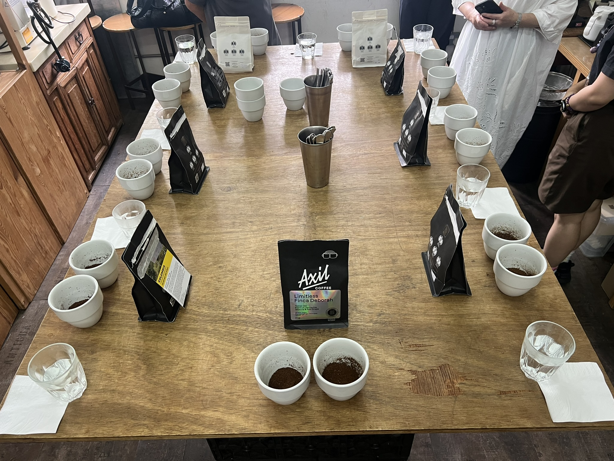
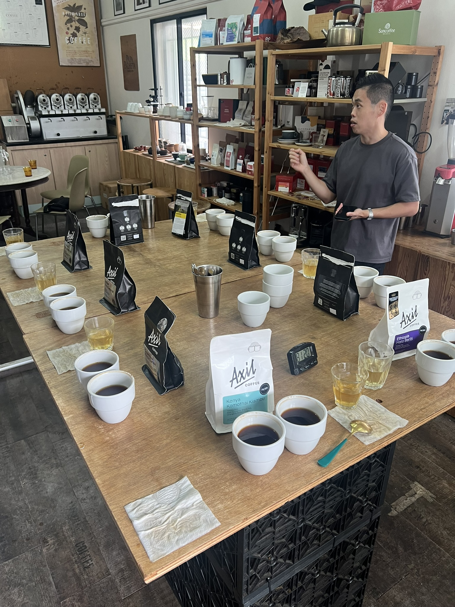
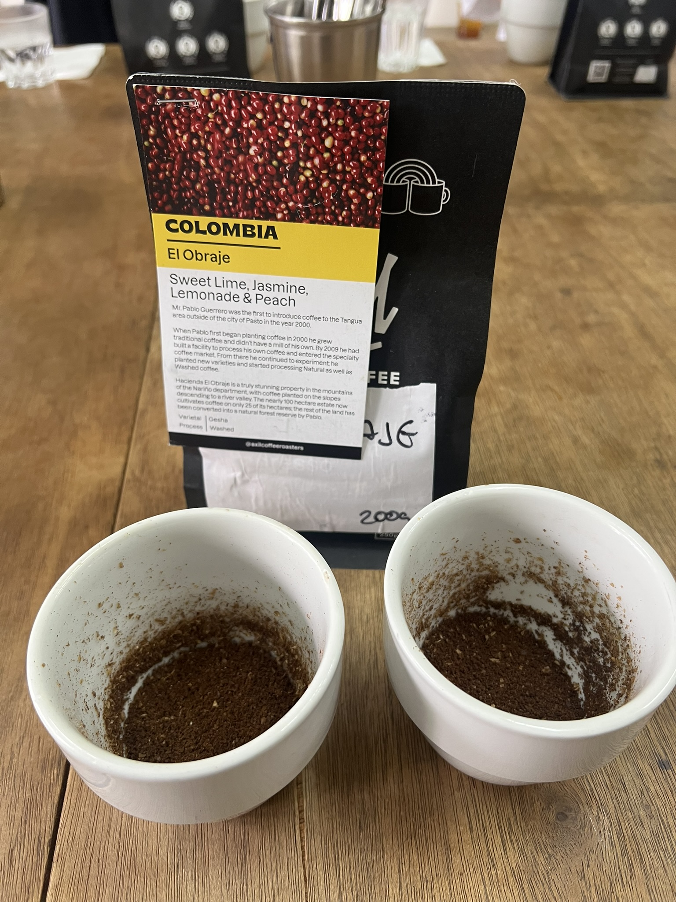
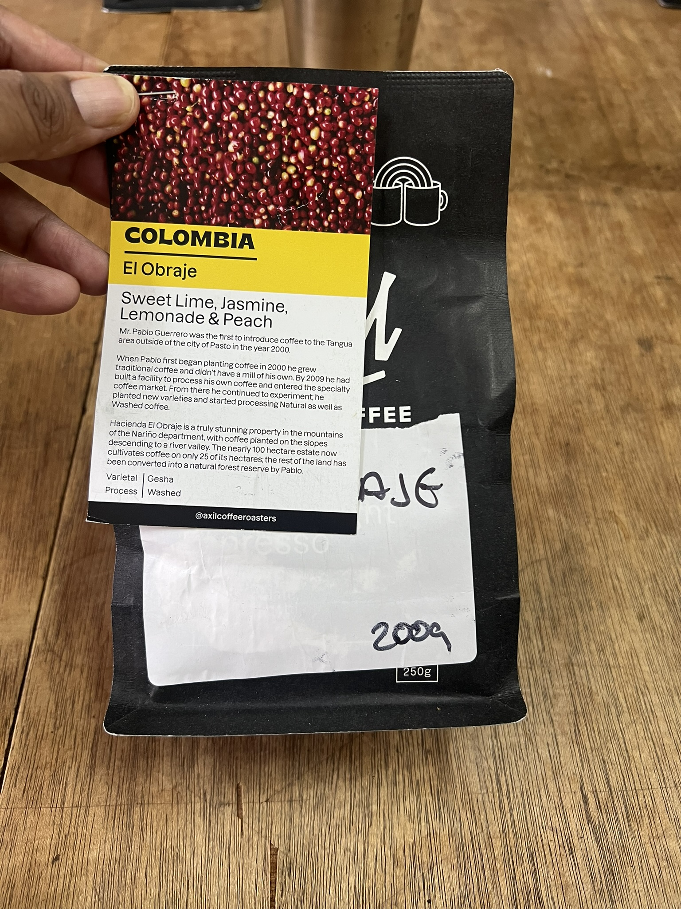
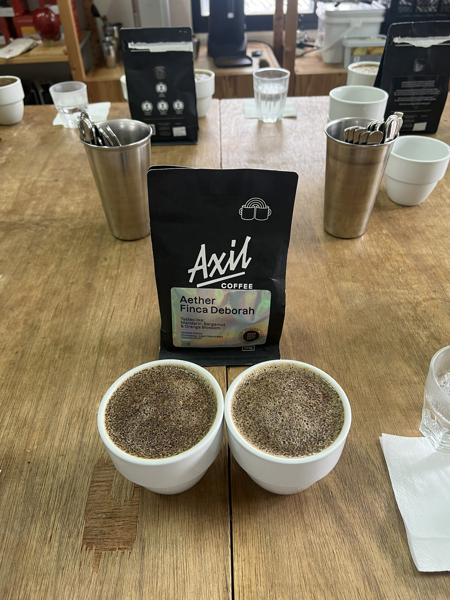
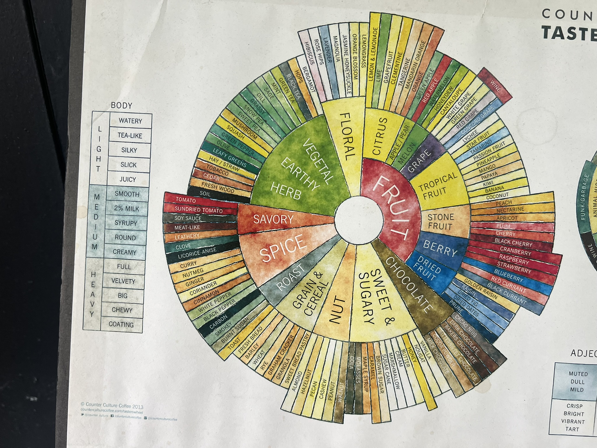
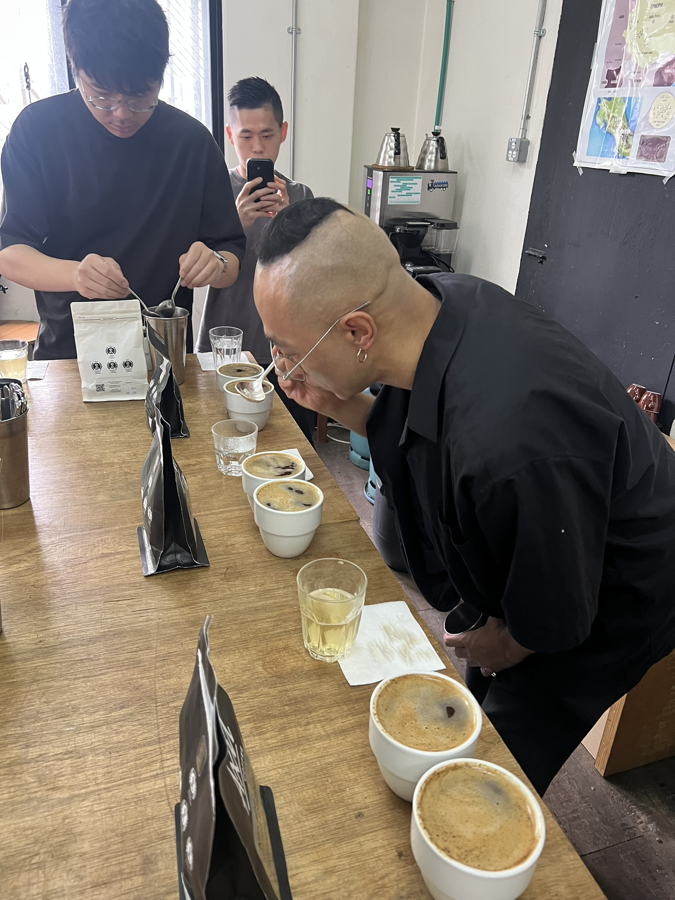
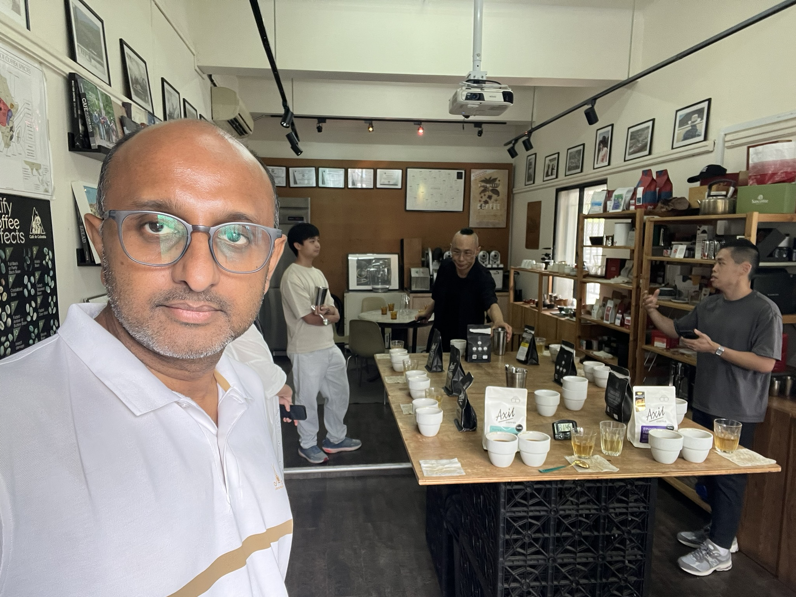

# My First Public Cupping: Tasting World-Class Geshas with Karl Lee

*Public Cupping with Axil Coffee Roasters (Guest Roaster Series) — The Annex @ Chye Seng Huat Hardware, Singapore — 12 July 2026*

---

## An Old Friend on the Table

Some coffees stay with you. For me, that coffee is **El Obraje** — the washed Colombia Gesha from Hacienda El Obraje in Nariño. I first had it as a filter at Fluid Collective, and ever since, it has quietly sat at the top of my list of all the filters I've ever had. So when I walked into my first public cupping session this morning and spotted that black bag with the big photo of red cherries standing on the table, I knew this was going to be a good day.

## The Setting

The session was held at **The Annex @ Chye Seng Huat Hardware** (150 Tyrwhitt Road) — the heritage shophouse that used to be an actual hardware store before PPP Coffee transformed it into a coffee bar, roastery, and event space. It has that industrial-chic, slightly nostalgic feel: a long wooden table set on black crates, shelves of brewing gear and retail beans along the walls, framed photos, good natural light. Relaxed but professional.

The event was a **public cupping with Axil Coffee Roasters** as the guest roaster, hosted by **Karl Lee** — the 2026 Australian Cup Tasters Champion and a World Brewers Cup Certified Judge. Around ten coffees were laid out along the table, each station with two white ceramic cupping bowls of freshly ground coffee, the bag standing behind them as the identifier, metal cups full of spoons, water, and napkins. A large Counter Culture Taster's Flavor Wheel poster sat on the table — and it wasn't just decoration; Karl actually used it during the session.

Many of these lots were appearing in Singapore for the first time — rare, high-scoring coffees (89–90+), including the actual competition coffees used by 2025 World Barista Champion Jack Simpson. Several of the bags carry Axil's "Roaster of the World Barista Champion" badge, and the holographic Finca Deborah labels wear the championship selection seal for 2023, 2024 and 2025.

## What Even Is a Public Cupping?

For anyone who hasn't been to one: a cupping is how coffee professionals evaluate coffee. Ground coffee sits in bowls, hot water is poured over, and after a few minutes you "break the crust" that forms on top and smell the aromas released. Then, once it cools a little, you taste — by slurping from a spoon — and compare coffees side by side as they cool and their flavours evolve. It's the most honest way to taste coffee: no fancy brewing tricks, just the coffee itself.

This was my first time doing it properly, and Karl guided us through the whole process.

## The Lineup

Karl grouped the coffees by origin — **Colombia, Panama, and Kenya** — and walked us through each group with his own commentary.

**Ethiopia Halo Beriti** — Mixed Heirloom, washed. Notes of lemons, nectarine, jasmine and sugarcane. Classic bright, floral, clean Ethiopian. ([photo](IMG_5975.JPEG))

**Colombia Vergara Brothers** — Red Bourbon, washed. Grapefruit, dates and red grape. Juicy, red-fruit-forward. ([photo](IMG_5976.JPEG))

**Colombia El Obraje** — Gesha, washed. Sweet lime, jasmine, lemonade and peach. My personal winner (more on this below). The bag itself carries the farm story of Pablo Guerrero, who started planting in 2000 and built his own mill in 2009, plus a handwritten weight sticker. ([photo](IMG_5969.JPEG))

**Colombia Jardines del Eden** — Java varietal, natural. Blood orange, violet, grilled pineapple and panela. An unusual varietal in natural processing — tropical and distinctive, part of Axil's holographic Signature Series. ([photo](IMG_5978.JPEG))

**The Finca Deborah trio (Panama)** — three expressions of Gesha from the same farm, all carrying the championship selection badge (2023–2025):

- **Limitless** — Argon Macerated Natural. Starfruit, nectarine, jasmine and red grape. ([photo](IMG_5979.JPEG))
- **Nirvana** — Nitrogen Macerated Natural. Blood orange, black cherry, violet and cacao nibs. ([photo](IMG_5981.JPEG))
- **Aether** — Argon Macerated Washed Finish. Mandarin, bergamot and orange blossom. ([photo](IMG_5972.JPEG))

**Kenya Komothai Kiambu** — SL28, SL34, Ruiru 11 and Batian, washed. Red currants, black tea, orange and brown sugar. ([photo](IMG_5974.JPEG))

**Colombia Finca Zarza** — Papayo varietal, "Fruit Forward Lush Natural". Cherry, violet, maraschino cherry, green toffee apple and dark chocolate. ([photo](IMG_5973.JPEG))

## El Obraje: Still My Number One

Tasting El Obraje again brought back all the memories from Fluid Collective. It was exactly as I remembered — **clear, bright, light and tea-like, with high clarity**. A nice slight tinge of mandarin orange and lime came through, with a bit of sweetness at the end. And for something so light and clean, the body was surprisingly good. Everything about it felt balanced and transparent. It confirmed what I already believed: this remains my top filter coffee so far.

The bag itself has personality to match — the front carries the full farm story of Pablo Guerrero, and this one even had a handwritten weight sticker on it. A coffee with a story, inside and out.

## The Finca Deborah Geshas: The Stars of the Table

The three Panama Geshas from **Finca Deborah** were the most talked-about lots of the day. I liked all three, but the **washed one (Aether)** stood out for me — it was especially clear, almost similar to El Obraje in its clarity and tea-like character. The two naturals (Limitless and Nirvana) were fruitier and more complex, but I kept coming back to that clean, transparent feel of the washed versions. Clearly I have a type.

Karl mentioned that the Finca Deborah lots are among the most popular and award-winning beans right now, and after tasting them side by side I can see why. Getting three different experimental processings — argon macerated natural, nitrogen macerated natural, and an argon macerated washed finish — of the same varietal from the same farm in one lineup was a rare and genuinely educational experience. Even the bags look the part, with those holographic labels catching the light.

## The Funky One: Finca Zarza

And then there was the **Colombia Finca Zarza** — the Papayo. This was the most expensive lot on the table and by far the most unique. Super funky in both smell and taste, with a strong **green apple** character running through it. Karl said these experimental lots from Colombia can be quite pricey, and this one definitely stood out as the most intense and unusual coffee of the day. Not my style, but I'm glad I tasted it — it's the kind of coffee you remember.

## What Karl Taught Us

Karl is originally from Korea and now based in Australia, and he's exceptionally good at cupping and blind tasting — his flavour sensing is on another level. Two things he shared stuck with me.

**The acids behind the flavours.** Using the flavor wheel, Karl broke down the acids that form the core of coffee taste: **malic acid** gives that crisp green apple note (hello, Finca Zarza), **citric acid** brings the brighter, lemony character, and **acetic acid** adds a sharper edge, often in fermented or natural-processed coffees. The interesting part was his point that the *same* fruit impression can come from *different* acids, and each feels different on the palate. I'll be honest — I didn't grasp all of it in one go. This is firmly on my to-learn list now, but hearing how these acids actually show up in the cups in front of us made it real in a way reading never could.

**Proper slurping.** Today I learned to slurp correctly for the first time. You don't put the spoon inside your mouth — you hold it at your lips and suck the coffee in from the tip so it aerates across your palate. Combined with breaking the crust and smelling, then walking around the table comparing how each coffee's aroma changed as it cooled, the whole ritual finally clicked for me. The group discussion around the table — everyone sharing what they smelled and tasted — made it feel collaborative rather than intimidating.

## The People

The coffee was the draw, but the people made the morning.

I had a long conversation with **Jiun Loong**, the PPP Operations Head — who, it turns out, was a Singapore barista champion a few years ago. I showed him my cafe apps and the audit archive I've been building, and he was genuinely impressed. We exchanged Instagram handles and he said he'll keep me posted on upcoming events.

I also met **Clement**, a student from Singapore Polytechnic who brews at home and experiments with different filters. We talked coffee, and he told me about the SIGEP barista competitions happening this week. We exchanged numbers and he shared some Signal groups and Instagram handles for local coffee meetups.

The table had a nice mix of people beyond that: a tourist from Japan, a quiet but clearly interested local lady, and a guy from Johor Bahru who works in Singapore — he told me the best specialty cafes in Johor right now are **Sweet Blossoms** and **Cold Coffee Roasters**. Noted for a future trip.

And at the end, Karl exchanged his Instagram with me too.

## Final Reflections

For a first public cupping, I couldn't have asked for more. I got to re-taste a coffee I love and confirm it's still my number one. I tasted three experimental Geshas from one of the most awarded farms in the world, side by side. I learned proper technique, got a first real lesson in coffee acids, and walked away with new connections in the local coffee scene.

These lots are going straight into my archive — El Obraje, the Finca Deborah trio, and the Zarza — with my tasting notes and what Karl shared about each.

Definitely worth the early Sunday morning. I'll be back for the next one.

---

### Key Takeaways

- **My winner:** Colombia El Obraje (washed Gesha) — clear, tea-like, mandarin orange and lime, sweet finish. Still my top filter.
- **Closest challenger:** Aether (Finca Deborah, washed finish) — nearly the same clarity and tea-like character.
- **Most popular/awarded:** the Finca Deborah series (Limitless, Nirvana, Aether).
- **Most expensive and funkiest:** Colombia Finca Zarza (Papayo) — intense green apple.
- **Technique learned:** break the crust, smell, and slurp from the tip of the spoon at your lips — never spoon-in-mouth.
- **To learn next:** coffee acids — malic vs citric vs acetic and how they shape flavour.
- **Connections made:** Jiun Loong (PPP Ops Head, ex-SG barista champion), Clement (SP student), Karl Lee, plus meetup groups and Johor cafe recommendations.
